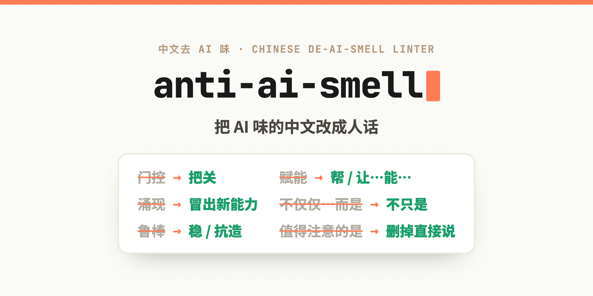
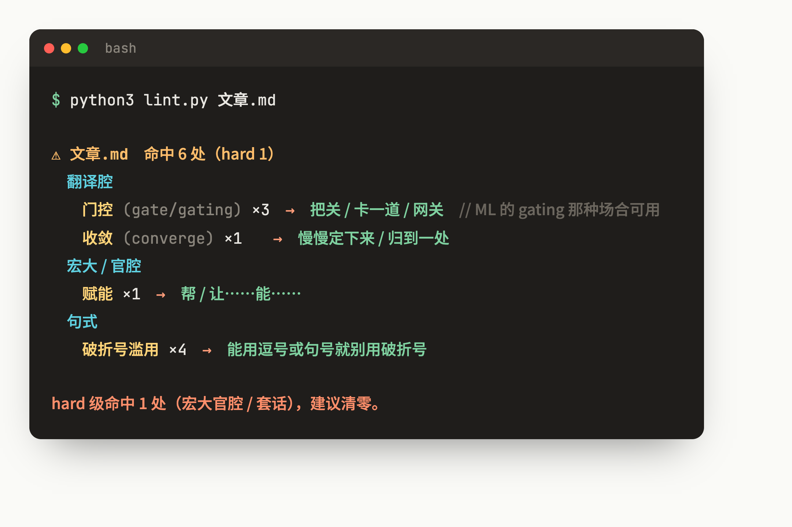

<div align="center">
  

  <h1>anti-ai-smell</h1>
  <p><strong>把 AI 味的中文改成人话。</strong></p>
  <p><em>一个无依赖的 linter + 词表 + Claude skill。标出 AI 生成中文里的那些「味儿词」，告诉你一个人平时会怎么说。</em></p>

  <p>
    <a href="LICENSE"></a>
    
    
    
    <a href="https://github.com/androidZzT/anti-ai-smell/stargazers"></a>
  </p>

  <p>
    <a href="#是什么">是什么</a> &bull;
    <a href="#快速开始">快速开始</a> &bull;
    <a href="#词表">词表</a> &bull;
    <a href="#两条原则">两条原则</a> &bull;
    <a href="#加词">加词</a> &bull;
    <a href="README.md">English</a>
  </p>
</div>

---

## 是什么

AI 写中文有一股固定的「味儿」。它爱把英文概念硬翻成生硬的词——`门控`（gate）、`横切`（cross-cutting）、`一等公民`（first-class）；爱造母语者不用的新词——`切法`、`硬货`；爱给平淡的事套戏剧化形容——`理直气壮的谎`、`欢快的成功`；还爱端着宏大官腔——`赋能`、`涌现`、`不仅仅……而是……`。

单看每个词都没错。但堆在一起，读者一眼就知道：这是 AI 写的。

**anti-ai-smell 做一件事：把这些词标出来，换成人话。**

它是一个 linter + 一张词表，也是一个 [Claude Skill](https://docs.claude.com/en/docs/claude-code/skills)。和管句子结构的去 AI 味工具互补——那些管句式，这个管**中文特有的词汇口味**。

<div align="center">
  
</div>

---

## 快速开始

```bash
git clone https://github.com/androidZzT/anti-ai-smell.git
cd anti-ai-smell

# 扫一份稿子
python3 lint.py 你的文章.md

# 看整张词表
python3 lint.py --list
```

Python 3，无第三方依赖。命中 **hard** 级（宏大官腔 / 套话）退出码为 `1`，否则 `0`，可以塞进 CI。

---

## 词表

51 词 6 类，外加几条 AI 味句式（破折号滥用、修辞性设问、否定式排比、emoji 等）。

| 类别 | 例子 | 人话 |
|---|---|---|
| **生造词** | 切法 / 硬货 / 打法 | 这个角度 / 干货 / 做法 |
| **翻译腔** | 门控(gate) / 横切(cross-cutting) / 鲁棒(robust) / 一等公民(first-class) | 把关 / 通用那部分 / 稳 / 原生支持 |
| **戏剧化** | 理直气壮的谎 / 欢快的成功 / 最容易的死法 | 报告成功其实失败了 / 又报了个「成功」/ 最容易翻车的地方 |
| **带味的字** | 偷师 / 偷凭证 | 学 / 窃取凭证 |
| **宏大 / 官腔** | 赋能 / 涌现 / 不仅仅 / 长出 | 帮 / 冒出新能力 / 不只是 / 新增 |
| **套话 / 连接词** | 值得注意的是 / 此外 / 至关重要 | 删掉直接说 / 另起一句 / 关键 |

完整词表见 [`data/ai-flavor-words.json`](data/ai-flavor-words.json)。

---

## 两条原则

**1. 不机械替换。** linter 只标位置、给建议，改不改、怎么改，按语境定。很多词在专业场合有精确含义：

- `门控` 在机器学习（gating network）、电路里是精确术语，那种上下文保留。
- `收敛` 在数学、迭代算法里是术语，别乱替。

判断标准就一句：**这话，一个母语者平时会不会这么说。** 会就留，不会就换。

**2. 正常术语不算 AI 味。** `幂等`、`编排`、`缓存` 这类圈内人正常用的词，不在词表里。anti-ai-smell 针对的是「生造 / 翻译腔 / 戏剧化 / 官腔」，不是「所有专业词」。

---

## 当 Claude Skill 用

把整个目录放进 `~/.claude/skills/anti-ai-smell/`，Claude 写完中文稿子会自动扫一遍去 AI 味。详见 [`SKILL.md`](SKILL.md)。

---

## 加词

词表是社区维护的。发现新的 AI 味词，往 [`data/ai-flavor-words.json`](data/ai-flavor-words.json) 对应类别里加，或提 PR。收词标准：**母语者平时不这么说，但 AI 老写它。**

```json
{"w": "门控", "en": "gate / gating", "human": ["把关", "卡一道", "网关"], "note": "ML 的 gating / 电路里可用"}
```

---

## 致谢

- 句式层的去 AI 味思路，参考 [Wikipedia: Signs of AI writing](https://en.wikipedia.org/wiki/Wikipedia:Signs_of_AI_writing)。
- 词表来自日常中文写作里被反复逮到的真实案例，持续补充。

## License

[MIT](LICENSE)
